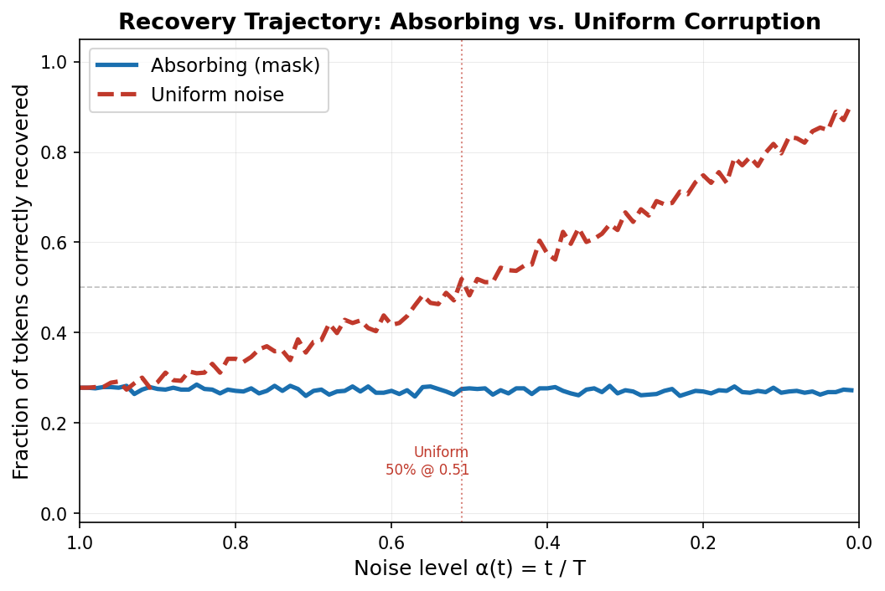

# Discrete Diffusion: Corruption Schedule Comparison

A small project comparing two corruption schedules — absorbing and uniform — in 
discrete diffusion models for text. Built to get more experience with how 
diffusion works on discrete data like language, and specifically to understand 
how the choice of noise schedule affects what the model learns.

## Research Question

> Does the choice of corruption schedule affect how quickly and reliably the model
> recovers semantic content during reverse diffusion?

## Structure

```
discrete_diffusion/
├── data/
│   └── dataset.py          # Penn Treebank loader + tokenizer
├── models/
│   └── denoiser.py         # Transformer denoising model
├── training/
│   ├── corruption.py       # Absorbing + uniform corruption schedules
│   └── train.py            # Training loop
├── analysis/
│   └── evaluate.py         # Recovery curves, perplexity, entropy analysis
├── run_experiment.py       # Main entry point — trains both models + plots results
└── README.md
```

## Quickstart

Tested on Google Colab free tier (T4 GPU, ~1-2 hrs). Switch to a T4 via
Runtime → Change runtime type → T4 GPU before running.

**1. Clone the repository**
```bash
git clone https://github.com/chou162/discrete-diffusion-schedule-comparison.git
cd discrete-diffusion-schedule-comparison
```

**2. Install dependencies**
```bash
pip install torch datasets tqdm matplotlib numpy
```

**3. Download Penn Treebank**
```python
import urllib.request, os
os.makedirs("data/ptb", exist_ok=True)
urllib.request.urlretrieve(
    "https://raw.githubusercontent.com/wojzaremba/lstm/master/data/ptb.train.txt",
    "data/ptb/train.txt"
)
urllib.request.urlretrieve(
    "https://raw.githubusercontent.com/wojzaremba/lstm/master/data/ptb.valid.txt",
    "data/ptb/valid.txt"
)
```

**4. Run**
```bash
python run_experiment.py --epochs 30 --d-model 256 --n-layers 3 --batch 32 --lr 5e-5
```

Results are saved to `results/` — recovery curves, perplexity comparison,
token entropy plots.
## Results



The uniform schedule converged to a much lower validation loss than absorbing 
(2.83 vs 4.48). It achieved 50% token recovery at noise level α=0.51 while 
absorbing never crossed that threshold.

My interpretation: under a floored linear noise schedule, absorbing only 
computes loss at masked positions, which means the gradient signal gets sparse 
at low timesteps. Uniform supervises every position at every step, which seems 
to give the model more consistent signal to learn from — at the cost of harder 
individual predictions. The entropy curves back this up: uniform's entropy 
drops sharply at low noise while absorbing's stays flat, suggesting the 
absorbing model never becomes confident in its predictions.

## Key Concepts

- **Absorbing schedule**: at each timestep t, tokens are independently replaced 
  with a special [MASK] token with probability t/T. The model always knows which 
  positions were corrupted.
- **Uniform schedule**: tokens are replaced with a random vocabulary token with 
  probability t/T. No explicit corruption signal — the model has to figure out 
  which tokens are wrong from context.
- **Recovery curve**: fraction of non-padding tokens correctly predicted at each 
  reverse diffusion timestep
- **Token entropy**: average H(p) = -Σ p log p of the model's output distribution, 
  measuring how uncertain the model is at each noise level
